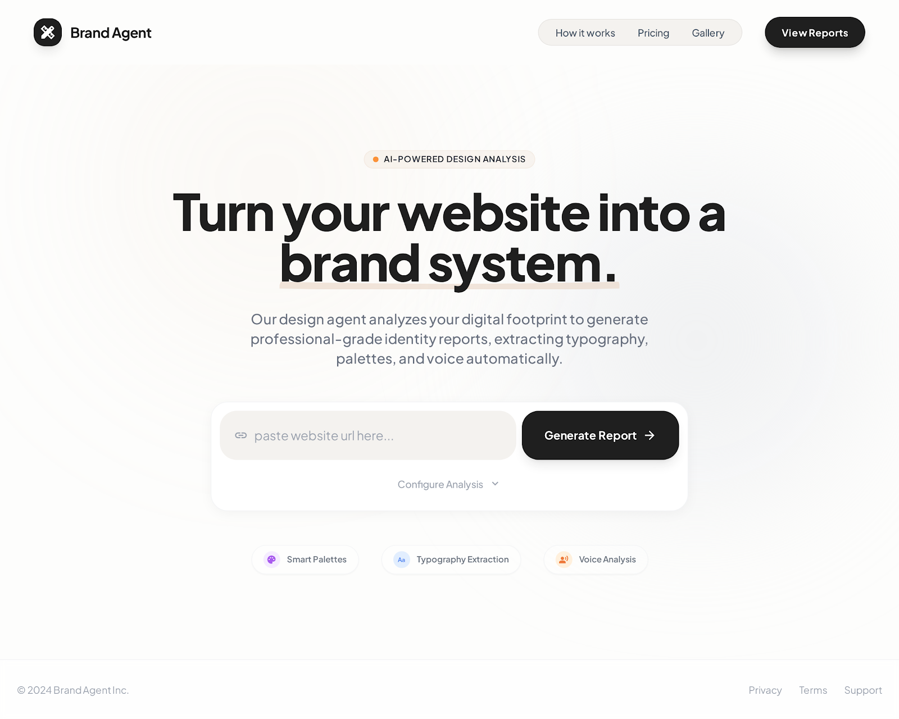
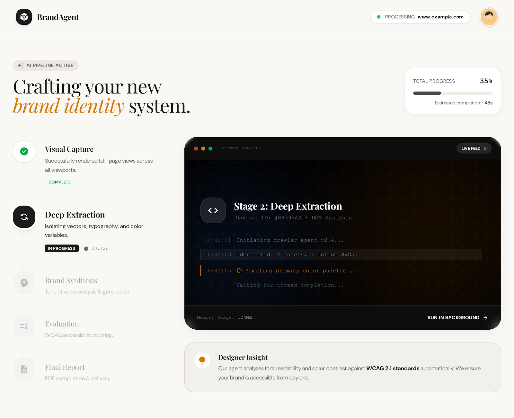

# Brand Canonizer

<div align="center">

**AI-Powered Design Analysis Tool**

Extract brand identity from any website and generate machine-readable, reusable brand specifications

[](https://www.typescriptlang.org/)
[](https://reactjs.org/)
[](https://nodejs.org/)
[](https://tailwindcss.com/)

</div>

---

## Overview

Brand Canonizer is a glass-box system that analyzes existing websites and produces **structured, machine-consumable brand identity specifications**. Unlike generic design extraction tools, Brand Canonizer produces actionable, parseable specifications with full process transparency—not just pretty reports.

### Key Features

- **AI-Powered Analysis**: Claude Vision API for intelligent design pattern recognition
- **Real-Time Progress**: Server-Sent Events streaming for live extraction updates
- **Comprehensive Reports**: Complete brand specifications with quality evaluation
- **Machine-Readable Output**: JSON specifications that can be used by AI builders
- **Full Transparency**: Detailed execution traces with timing, tokens, and costs
- **Modern UI**: Professional interface with Plus Jakarta Sans typography

### Screenshots

<div align="center">

#### Landing Page

*Clean, professional interface with AI-powered brand extraction*

#### Processing & Results

*Real-time extraction progress with detailed brand analysis*

</div>

---

## Purpose

Brand Canonizer produces structured, machine-consumable brand identity specifications that can be:

1. **Used by Claude Code** (or any AI builder) to generate matching designs
2. **Inspected by humans** for quality and completeness
3. **Iterated on and improved** over time

This makes it a valuable tool for design systems, brand consistency, and AI-assisted design workflows.

---

## Architecture

```
┌─────────────┐
│   Input     │  URL + optional adjectives
└──────┬──────┘
       │
       v
┌─────────────┐
│  CAPTURE    │  Playwright → screenshots + DOM/CSS
└──────┬──────┘
       │
       v
┌─────────────┐
│  ANALYZE    │  Claude Vision → brand_tokens.json
└──────┬──────┘
       │
       v
┌─────────────┐
│ SYNTHESIZE  │  Structured → brand_spec.json
└──────┬──────┘
       │
       v
┌─────────────┐
│  EVALUATE   │  Rubric → scores + recommendations
└──────┬──────┘
       │
       v
┌─────────────┐
│   REFINE    │  If score < 4.5 → improve spec (NEW!)
└──────┬──────┘
       │
       v
┌─────────────┐
│   Output    │  Machine-readable spec + diagnostics
└─────────────┘
```

**Pipeline Improvements (Dec 2024):**
- ✅ Evaluation now focuses on extraction quality, not source brand criticism
- ✅ Automatic refinement for scores below 4.5 using evaluation feedback
- ✅ Removed placeholder component generation - only real components now
- ✅ Living style guide with copy-paste HTML/CSS code examples

---

## 📚 Design Knowledge Base

**IMPORTANT:** Before making changes to reports or style guides, always consult these knowledge documents:

### 1. **[docs/STYLE_GUIDE_DESIGN_PRINCIPLES.md](docs/STYLE_GUIDE_DESIGN_PRINCIPLES.md)**

Documents technical style guide best practices:
- Expert insights from product, design, and engineering perspectives
- Core design principles for professional brand style guides
- Component card specifications and standards
- Visual design standards and CSS patterns
- AI agent optimization strategies
- Success metrics and best practices
- Research from professional design systems (Shopify Polaris, Material Design, Stripe, Carbon)

**Key Principle:** Professional style guides show **artifacts (components with code)** not just **specifications (design tokens)**.

### 2. **[docs/EXPRESSIVE_BRAND_PRESENTATION.md](docs/EXPRESSIVE_BRAND_PRESENTATION.md)** ⭐ NEW

Documents principles for creating visually expressive brand reports:
- Transform technical specs into visual brand stories
- Show brands in action with real screenshots prominently
- Create mood boards and visual storytelling
- Present brands like pitch decks, not technical documents
- Complete ecosystem view (hero, sections, components, all together)
- Learnings from Nano Banana Pro brand creation methodology

**Key Insight:** Brand reports should be **experienced, not just read**. Lead with large, beautiful visuals that immediately convey brand personality.

**For Future Claude Code Instances:**
When working on Brand Canonizer reports, always:
1. **Lead with visuals** - Screenshots are essential, not optional
2. **Show, don't just tell** - Real artifacts over specifications
3. **Context is king** - Components in their natural environment
4. **Visual storytelling** - Structure like a portfolio, not a technical doc
5. **High-quality imagery** - Large, crisp screenshots (1920px+ width)
6. **Complete ecosystem** - Show the full brand journey from hero to footer

This ensures the report captures the brand's personality and visual impact, making it immediately understandable to design, product, and engineering teams.

---

## Core Outputs

### Machine-Readable Artifacts

1. **brand_spec.json** - Machine-readable brand specification (primary artifact)
   - Design tokens (colors, typography, spacing)
   - Component specifications
   - Design patterns and rules

2. **evaluation.json** - Quality scores and recommendations
   - 6-dimension rubric scoring
   - Detailed justifications
   - Improvement suggestions

3. **execution_trace.json** - Process diagnostics
   - Stage-by-stage timing
   - Token usage and costs
   - Full transparency

4. **metadata.json** - Extraction metadata
   - Source URL and timestamp
   - Brand identification
   - Configuration used

### Human-Readable Reports

- **Interactive Report Viewer** - Beautiful, tabbed interface with:
  - Brand Identity tab: Visual showcase of colors, typography, and components
  - Diagnostics tab: Evaluation scores, timeline, and downloadable artifacts

---

## Quick Start

### Installation

```bash
# Clone the repository
git clone <repository-url>
cd brand-canonizer

# Install backend dependencies
npm install

# Install frontend dependencies
cd frontend && npm install && cd ..

# Set up environment variables
cp .env.example .env
# Edit .env and add your ANTHROPIC_API_KEY
```

### Development

```bash
# Start both backend and frontend servers
npm run dev

# Or run separately:
npm run dev:backend  # Backend API (port 3000)
npm run dev:frontend # Frontend UI (port 5173)
```

### Usage

1. **Open the app**: Navigate to http://localhost:5173
2. **Enter a URL**: Paste any website URL (e.g., https://stripe.com)
3. **Watch extraction**: Real-time progress updates via Server-Sent Events
4. **View report**: Interactive report with brand identity and diagnostics
5. **Download artifacts**: JSON files for programmatic use

### API Usage

```bash
# Start extraction
curl -X POST http://localhost:3000/api/extract \
  -H "Content-Type: application/json" \
  -d '{"url": "https://stripe.com", "adjectives": ["professional", "trustworthy"]}'

# List all brands
curl http://localhost:3000/api/brands

# Get specific brand
curl http://localhost:3000/api/brands/{brand_id}
```

---

## Project Status

**Phase 1 - Complete**: Core capture and extraction pipeline with professional UI

See [PROGRESS.md](docs/PROGRESS.md) for detailed status.

---

## Tech Stack

### Backend
- **Runtime**: Node.js + Express
- **Capture**: Playwright (headless browser automation)
- **Analysis**: Claude 3.5 Sonnet (vision + structured output)
- **Storage**: Local filesystem (JSON + HTML)
- **Streaming**: Server-Sent Events (SSE)

### Frontend
- **Framework**: React 19 + Vite
- **Routing**: React Router v7
- **Styling**: Tailwind CSS v4
- **HTTP Client**: Axios
- **Code Display**: React Syntax Highlighter

### Development
- **Testing**: Jest + Playwright Test
- **Validation**: JSON Schema (AJV)
- **Process Management**: Nodemon + Concurrently

---

## Documentation

- [SPEC.md](docs/SPEC.md) - Complete product specification
- [DECISIONS.md](docs/DECISIONS.md) - Architecture and design decisions
- [PROGRESS.md](docs/PROGRESS.md) - Implementation progress tracking
- [QUICKSTART.md](QUICKSTART.md) - Quick start guide with examples
- [Schemas](schemas/) - JSON Schema definitions for all data formats

---

## Success Criteria

- Extract 5 test sites with average score greater than or equal to 4.0/5
- Brand specs are machine-parseable and reusable by AI builders
- Reports are visually excellent (4.5+ design quality)
- Process is fully transparent (timing, tokens, artifacts available)

---

## Non-Goals (v1)

- Not a design tool (no Figma/Sketch export)
- Not a website builder (no code generation)
- Not inventing new brands (only extracting existing ones)
- Not silently evolving (explicit recommendations only)

---

## Contributing

This is a research project exploring AI-assisted design extraction. Contributions, feedback, and bug reports are welcome.

---

## License

MIT

---

<div align="center">

**Built with Claude Code**

[Documentation](docs/) • [Issues](../../issues) • [Changelog](CHANGELOG.md)

</div>
